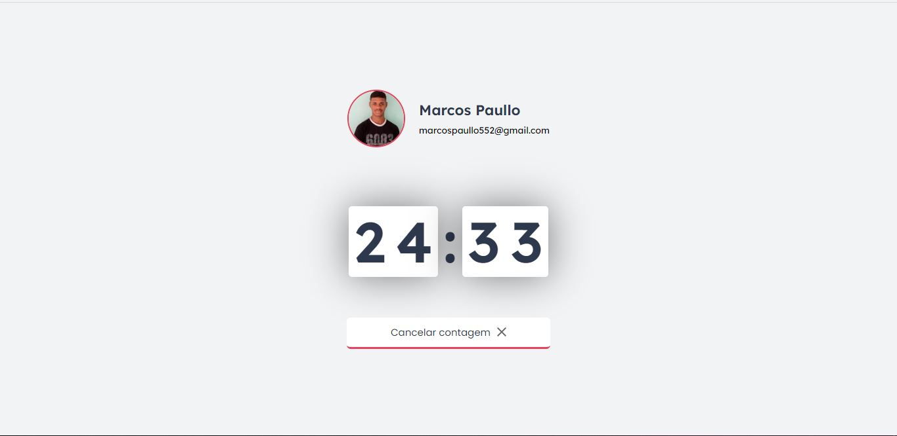

<h1 align="center">
    
</h1>

  

 

 

  

## ✨ Technologies

This project was developed with the following technologies:

- [ReactJS](https://reactjs.org)
- [Firebase](https://firebase.google.com)
- [Typescript](https://www.typescriptlang.org/)

## 💻 Project

This is an app that combines the Pomodoro technique with physical exercises for those who spend a lot of time in front of the computer, based on move.it, an application by Rocketseat

## 🔖 Layout

The layout was developed by the Rocketseat team and can be found at this [link](https://www.figma.com/file/ge20pu3ofMOKoliUyKx1Nl/Move.it-1.0). A [Figma account](https://figma.com) is required to access.

## 🚀 Run the project

- Clone this repository.
- Install dependencies with `npm install`
- Start the server with `npm run dev`

Now access [`localhost:3000`](http://localhost:3000) in your browser to view the application.

## 📄 License

This project is under the MIT license.

---

Made by [Marcos Paulo](https://github.com/marcosp-aulo) ❤

